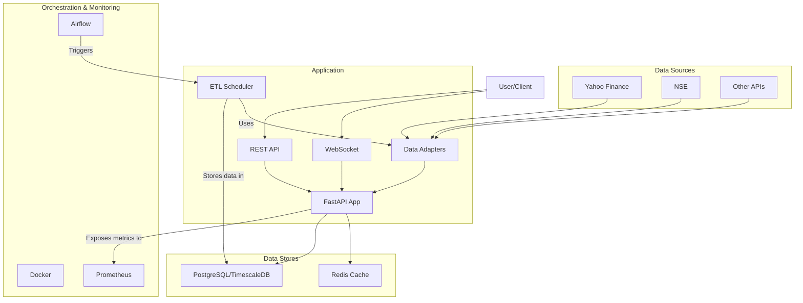

# Market Data Platform

**Real-time Index Data Aggregation & Distribution System**

This platform provides a robust solution for fetching, storing, and distributing real-time and historical financial market data for major indices. It's built with a modern Python stack, designed for scalability and performance.

## Features

- **Real-time Data Streaming**: WebSocket support for live OHLC (Open, High, Low, Close) data.
- **Historical Data API**: A RESTful API to query historical time-series data with flexible parameters (timeframe, limit).
- **Multi-Source Adapters**: A pluggable adapter system to fetch data from various sources (e.g., Yahoo Finance, NSE, Finnhub).
- **Efficient Caching**: Redis is used to cache recent data for low-latency access.
- **Persistent Storage**: PostgreSQL with TimescaleDB for efficient storage and querying of time-series data.
- **Scheduled ETL**: Apache Airflow is used to schedule and manage data extraction, transformation, and loading jobs.
- **Containerized Deployment**: Fully containerized with Docker and Docker Compose for easy setup and deployment.
- **Monitoring**: Integrated Prometheus metrics for application monitoring.
- **Interactive Frontend**: A simple frontend to visualize real-time data using Lightweight Charts.

## System Architecture



## Technology Stack

- **Backend**: Python 3.11, FastAPI, Pydantic v2
- **Database**: PostgreSQL, TimescaleDB
- **Cache**: Redis
- **ETL**: Apache Airflow
- **HTTP Client**: httpx
- **Deployment**: Docker, Docker Compose
- **Frontend**: HTML, Tailwind CSS, TradingView Lightweight Charts
- **Linting/Formatting**: Ruff

## Getting Started

### Prerequisites

- Docker
- Docker Compose

### One-Command Setup

1.  Clone the repository.
2.  Start all services using Docker Compose:

    ```bash
    docker-compose up --build
    ```

This command will build the images, start the FastAPI application, PostgreSQL database, Redis, and Airflow services.

- **FastAPI Application**: [http://localhost:8000](http://localhost:8000)
- **API Docs**: [http://localhost:8000/api/v1/docs](http://localhost:8000/api/v1/docs)
- **Airflow UI**: [http://localhost:8080](http://localhost:8080) (user: `airflow`, pass: `airflow`)

## API Endpoints

The following are the primary API endpoints. For a full interactive documentation, visit the API Docs link above.

| Method | Endpoint                      | Description                                      |
|--------|-------------------------------|--------------------------------------------------|
| `GET`  | `/`                           | Serves the frontend dashboard.                   |
| `GET`  | `/api/v1/ohlc/{symbol}`       | Get historical OHLC data for a symbol.           |
| `GET`  | `/api/v1/ohlc/{symbol}/latest`| Get the most recent OHLC candle.                 |
| `GET`  | `/api/v1/symbols`             | Get a list of supported symbols.                 |
| `GET`  | `/api/v1/health`              | Health check for the application.                |
| `WS`   | `/ws/ohlc/{symbol}`           | WebSocket endpoint for real-time OHLC data.      |

## ETL Pipeline

The project uses Apache Airflow to orchestrate the data pipeline.

- **DAG**: `market_data_etl`
- **Schedule**: Runs every 15 minutes.
- **Function**: Fetches daily data for a predefined list of symbols (`NIFTY`, `BANKNIFTY`, `SENSEX`, etc.) from the configured data sources and stores it in the PostgreSQL database.

You can monitor and manage the DAG from the Airflow UI.

## Project Structure

```
├── app/                # Main FastAPI application source code
│   ├── adapters/       # Data source adapters (Yahoo, NSE, etc.)
│   ├── api/            # API endpoint routers
│   ├── core/           # Core components (config, logging, exceptions)
│   ├── etl/            # ETL logic and scheduler
│   ├── models/         # Pydantic and SQLAlchemy models
│   ├── services/       # Business logic services (caching, DB access)
│   └── main.py         # FastAPI application entrypoint
├── dags/               # Airflow DAG definitions
│   └── market_data_etl.py
├── frontend/           # Frontend assets (HTML, CSS, JS)
│   └── index.html
├── infrastructure/     # Monitoring configurations (Prometheus, Grafana)
├── migrations/         # Database migration scripts
│   └── init.sql
├── docker-compose.yml  # Defines all services for local deployment
├── Dockerfile          # Dockerfile for the FastAPI application
└── pyproject.toml      # Project metadata and dependencies
```

## License

This project is licensed under the MIT License. See the `LICENSE` file for details.
